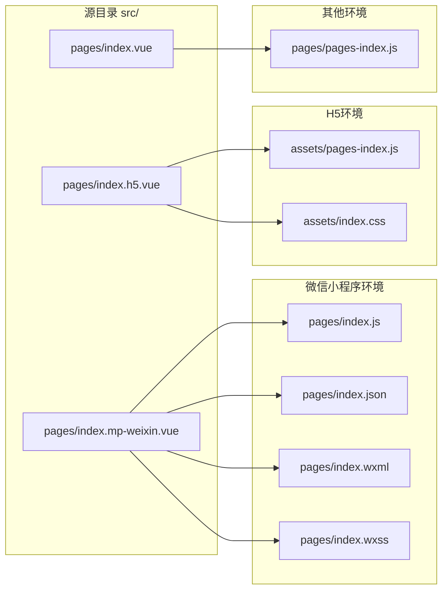

# @uni-helper/vite-plugin-uni-platform

> 基于文件名 (`*.<h5|mp-weixin|app>.*`) 的按平台编译插件

## 安装

```bash
pnpm i -D @uni-helper/vite-plugin-uni-platform
```

## 使用

```ts
// vite.config.ts
import { defineConfig } from 'vite'
import Uni from '@dcloudio/vite-plugin-uni'
import UniPlatform from '@uni-helper/vite-plugin-uni-platform'

export default defineConfig({
  plugins: [UniPlatform(), Uni()],
})
```

现在所有的带有平台标识符的文件都会被自动替换！


## 其他

<details>

<summary>与 @uni-helper/vite-plugin-uni-pages 插件一起使用</summary>
<br>

> [!NOTE]
> 自 vite-plugin-uni-pages 插件 0.2.12 起，不再需要进行处理。

```ts
// vite.config.ts
import { defineConfig } from 'vite'
import Uni from '@dcloudio/vite-plugin-uni'
import UniPlatform from '@uni-helper/vite-plugin-uni-platform'
import UniPages from '@uni-helper/vite-plugin-uni-pages'
import { platform } from '@uni-helper/uni-env'

export default defineConfig({
  plugins: [
    UniPlatform(),
    UniPages({
      onBeforeWriteFile(ctx) {
        const pagesMap = new Map()
        const pages = ctx.pageMetaData
          .filter(v => !/\..*$/.test(v.path) || v.path.includes(platform))
          .map(v => ({ ...v, path: v.path.replace(/\..*$/, '') }))
        pages.forEach(v => pagesMap.set(v.path, v))
        ctx.pageMetaData = [...pagesMap.values()]
      },
    }),
    Uni(),
  ],
})
```

</details>
